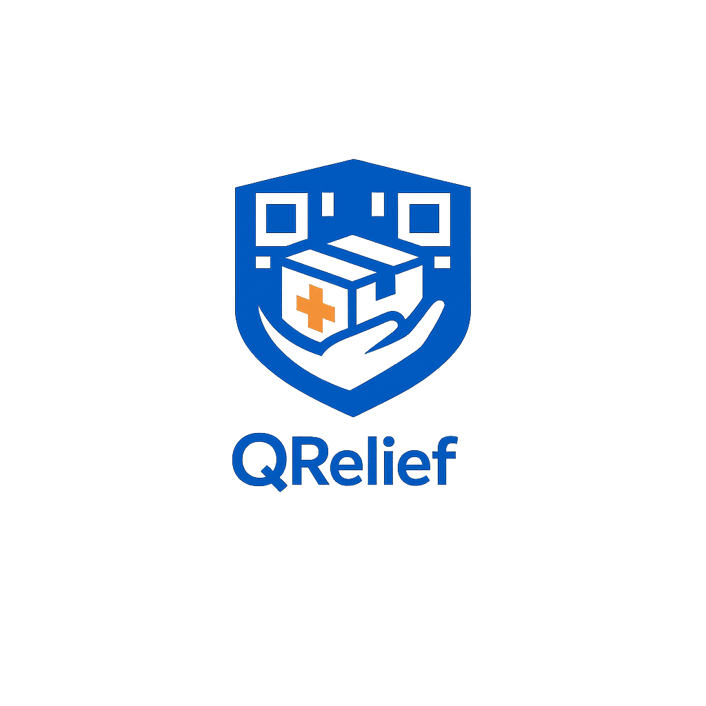

<div align="center">
  

  <p align="center">
    
    
    
    
    
  </p>

  <h3 align="center">One Scan, One Claim, No One Left Behind</h3>

  <p align="center">
    Android-first disaster-relief distribution app built for resilience and reliability.
    <br />
    <a href="#user-roles">User Roles</a>
    ·
    <a href="#key-features">Key Features</a>
    ·
    <a href="#documentation">Documentation</a>
  </p>
</div>

---

QRelief is designed to streamline the distribution of aid during disasters, supporting three distinct roles: Beneficiaries, Staff, and Administrators. It focuses on reliable QR-based distribution and works effectively in low-connectivity environments.

## Tech Stack

- **Framework:** [React Native](https://reactnative.dev/) with [Expo](https://expo.dev/)
- **Routing:** [Expo Router](https://docs.expo.dev/router/introduction/)
- **Backend:** [Supabase](https://supabase.com/) (Auth, Database, RLS, Edge Functions)
- **Language:** TypeScript
- **State Management:** React Hooks & Supabase Realtime

## User Roles

- **Beneficiary:** Can sign up, submit documentation for approval, and receive a unique QR code for aid collection.
- **Staff:** Can scan beneficiary QR codes, verify eligibility, and log aid distribution.
- **Admin:** Manages beneficiary approvals, inventory levels, staff assignments, and generates operational reports.

## Key Features

- **QR-Based Distribution:** Rapid and secure verification of beneficiaries in the field.
- **Offline Resilience:** Local persistence and sync queue for operations in areas with poor connectivity.
- **Role-Based Access Control:** Strict data security using Supabase Row Level Security (RLS).
- **Inventory Tracking:** Real-time monitoring of aid stock and low-stock alerts.
- **Disaster Readiness:** Optimized for speed and reliability under pressure.

## Project Structure

```text
app/          # Expo Router file-based routing
src/
  components/ # Reusable UI components
  features/   # Feature-specific logic (auth, inventory, etc.)
  lib/        # Third-party integrations (Supabase, sync logic)
  hooks/      # Custom React hooks
  types/      # TypeScript definitions
supabase/     # Migrations, schema, and edge functions
```

## Documentation

Detailed project plans and historical documentation can be found in the [plans/deprecated](./plans/deprecated) directory.

- [Master Plan](./plans/deprecated/QRelief_Master_Plan.md)
- [Testing Strategy](./plans/deprecated/TESTING_STRATEGY.md)
- [UI/UX Build Plan](./plans/deprecated/buildplanForUIUX.md)

## License

QRelief is dual-licensed:

- Open-source use: [GPLv3 License](licenses/LICENSE-GPL) — ensures that any improvements or modifications stay open-source.
- Commercial / government scaling: Requires the [Commercial License](licenses/LICENSE-COMMERCIAL) to earn revenue or deploy at national scale.

This supports our goal of equal-access open simulation while allowing monetization for continued development.

See the full files for details.

---
*Built for resilient disaster response.*
