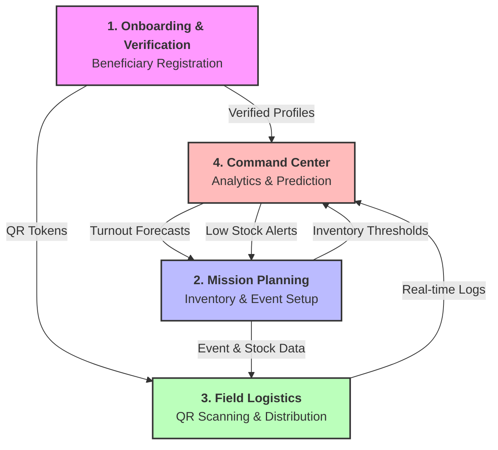

# QRelief: Inter-Module Map

This diagram shows the "Big Picture" of how data flows between the major components of QRelief.

```mermaid
graph TD
    %% Component Nodes
    A[<b>1. Onboarding & Verification</b><br/>Beneficiary Registration]
    B[<b>2. Mission Planning</b><br/>Inventory & Event Setup]
    C[<b>3. Field Logistics</b><br/>QR Scanning & Distribution]
    D[<b>4. Command Center</b><br/>Analytics & Prediction]

    %% Data Flows
    A -->|Verified Profiles| D
    A -->|QR Tokens| C
    
    B -->|Event & Stock Data| C
    B -->|Inventory Thresholds| D
    
    C -->|Real-time Logs| D
    
    D -->|Turnout Forecasts| B
    D -->|Low Stock Alerts| B

    style A fill:#f9f,stroke:#333,stroke-width:2px
    style B fill:#bbf,stroke:#333,stroke-width:2px
    style C fill:#bfb,stroke:#333,stroke-width:2px
    style D fill:#fbb,stroke:#333,stroke-width:2px
```
