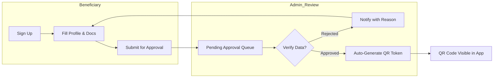

# QRelief: 2a - Onboarding & Verification (The Trust Gate)

*Handles the lifecycle of a beneficiary from signup to QR generation.*

```mermaid
graph LR
    subgraph Beneficiary
        Start[Sign Up] --> Profile[Fill Profile & Docs]
        Profile --> Submit[Submit for Approval]
    end

    subgraph Admin_Review
        Submit --> Queue[Pending Approval Queue]
        Queue --> Review{Verify Data?}
        Review -->|Rejected| Reason[Notify with Reason]
        Review -->|Approved| Trigger[Auto-Generate QR Token]
    end

    Trigger --> Success[QR Code Visible in App]
    Reason --> Profile
```
