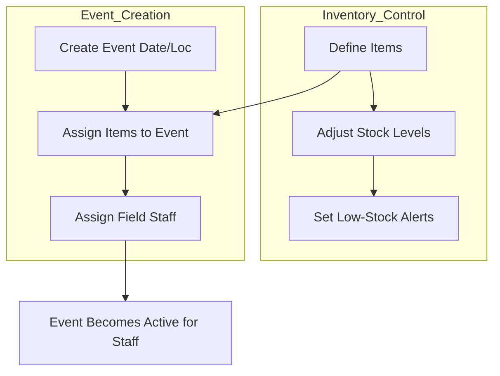

# QRelief: 2b - Mission Planning (Resource Allocation)

*Handles inventory stocking and staff assignment.*

```mermaid
graph TD
    subgraph Inventory_Control
        Items[Define Items] --> Stock[Adjust Stock Levels]
        Stock --> Threshold[Set Low-Stock Alerts]
    end

    subgraph Event_Creation
        Items --> Allocate[Assign Items to Event]
        EV[Create Event Date/Loc] --> Allocate
        Allocate --> Staff[Assign Field Staff]
    end

    Staff --> Ready[Event Becomes Active for Staff]
```
