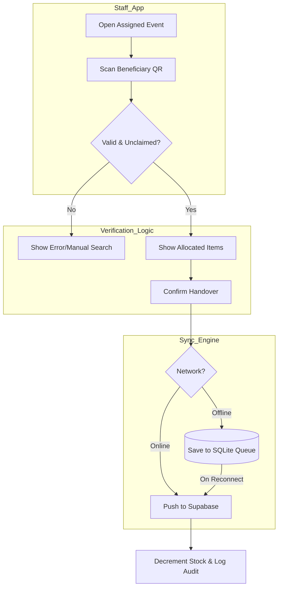

# QRelief: 2c - Field Logistics (Distribution & Sync)

*The core "Scan-to-Log" workflow used by staff in the field.*

```mermaid
graph TD
    subgraph Staff_App
        Entry[Open Assigned Event] --> Scan[Scan Beneficiary QR]
        Scan --> Verify{Valid & Unclaimed?}
    end

    subgraph Verification_Logic
        Verify -->|No| Error[Show Error/Manual Search]
        Verify -->|Yes| Show[Show Allocated Items]
        Show --> Confirm[Confirm Handover]
    end

    subgraph Sync_Engine
        Confirm --> Net{Network?}
        Net -->|Offline| Local[(Save to SQLite Queue)]
        Net -->|Online| DB[Push to Supabase]
        Local -->|On Reconnect| DB
    end

    DB --> Update[Decrement Stock & Log Audit]
```
