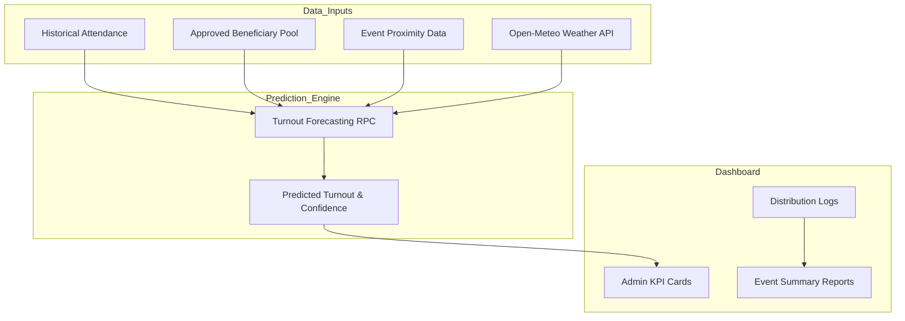

# QRelief: 2d - Command Center (Operational Intelligence)

*Data collection and turnout forecasting.*

```mermaid  
graph TD
    subgraph Data_Inputs
        Hist[Historical Attendance]
        Pool[Approved Beneficiary Pool]
        Loc[Event Proximity Data]
        Ext[Open-Meteo Weather API]
    end

    subgraph Prediction_Engine
        Hist & Pool & Loc & Ext --> ML[Turnout Forecasting RPC]
        ML --> Forecast[Predicted Turnout & Confidence]
    end

    subgraph Dashboard
        Forecast --> KPIs[Admin KPI Cards]
        Audit[Distribution Logs] --> Report[Event Summary Reports]
    end
```
