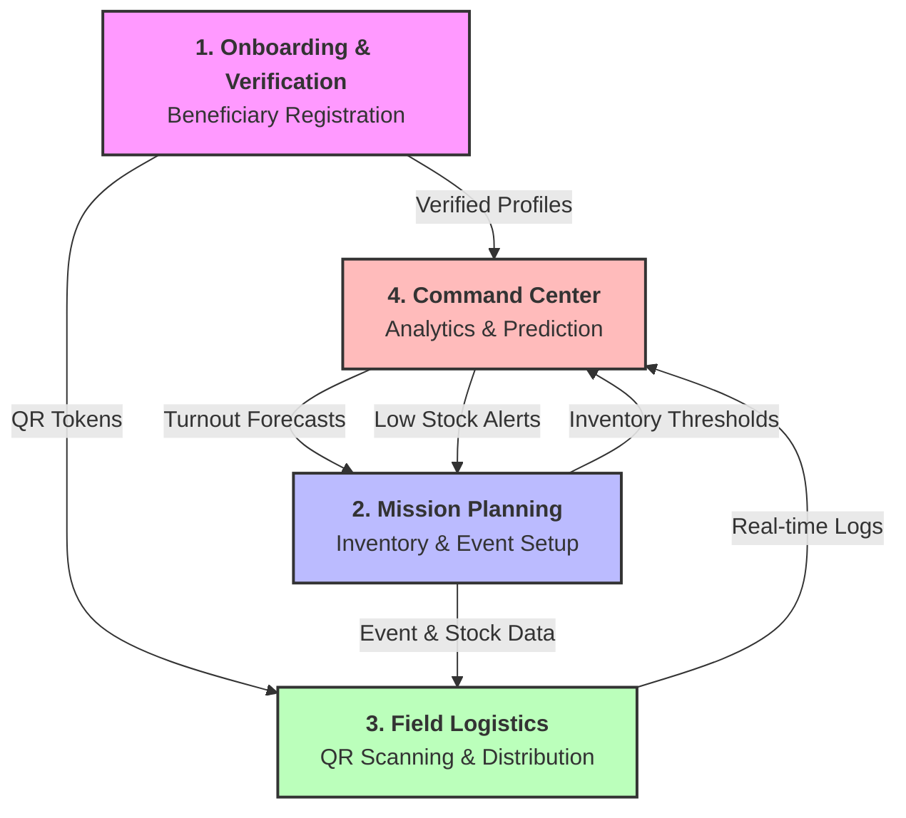
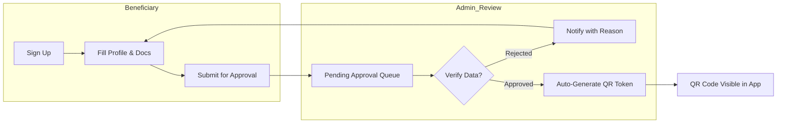
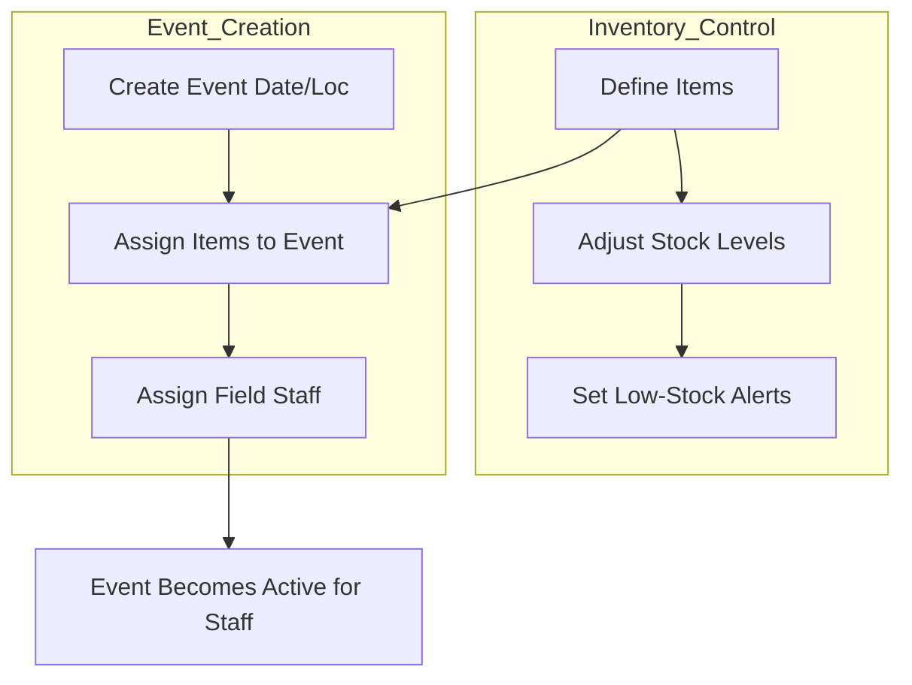
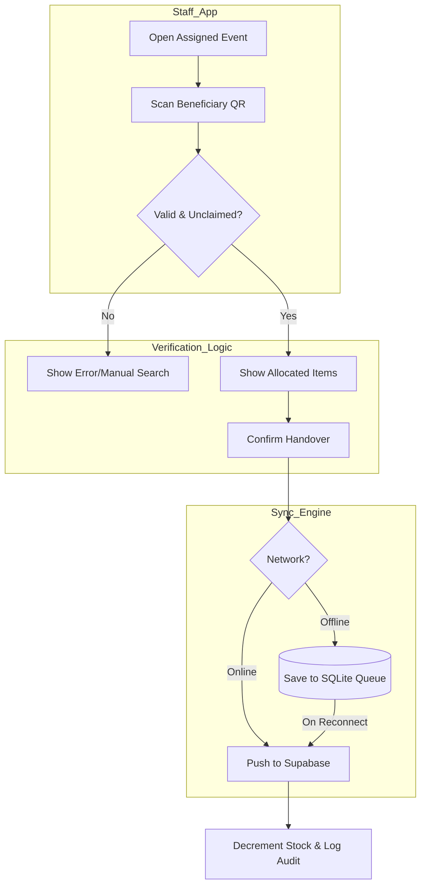
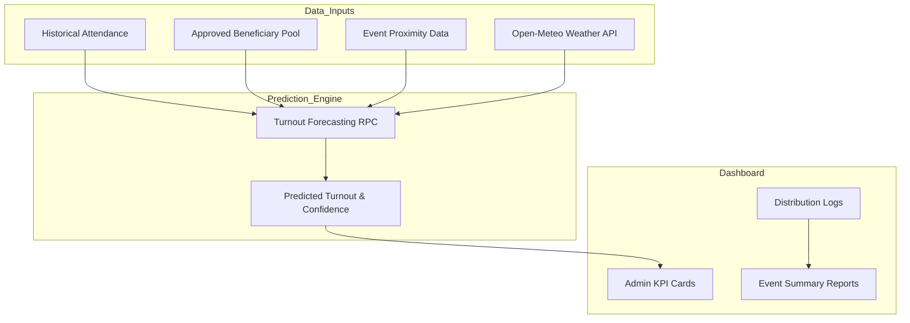

# QRelief System Flowcharts

### 1. High-Level System Overview (The Inter-Module Map)
This diagram shows the "Big Picture" of how data flows between the major components of QRelief.

---

### 2. Detailed Module Flowcharts

#### A. Onboarding & Verification (The Trust Gate)
*Handles the lifecycle of a beneficiary from signup to QR generation.*

#### B. Mission Planning (Resource Allocation)
*Handles inventory stocking and staff assignment.*

#### C. Field Logistics (Distribution & Sync)
*The core "Scan-to-Log" workflow used by staff in the field.*

#### D. Command Center (Operational Intelligence)
*Data collection and turnout forecasting.*

---

### Summary of Component Interactions
1.  **Onboarding** handles the "Who" (Security).
2.  **Mission Planning** handles the "What & Where" (Resources).
3.  **Field Logistics** handles the "How" (Execution).
4.  **Command Center** handles the "Why & When" (Strategy).